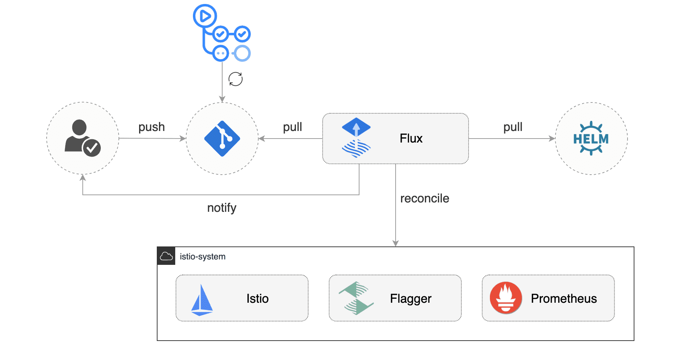

# gitops-istio

[](https://github.com/stefanprodan/gitops-istio/actions)
[](https://github.com/stefanprodan/gitops-istio/actions)
[](https://github.com/stefanprodan/gitops-istio/blob/main/LICENSE)

This is a guide where you will get hands-on experience with GitOps and
Progressive Delivery using Kubernetes and Istio.

## Introduction

### What is GitOps?

GitOps is a way to do Continuous Delivery, it works by using Git as a source of truth
for declarative infrastructure and workloads.
For Kubernetes this means using `git push` instead of `kubectl apply/delete` or `helm install/upgrade`.

In this workshop you'll be using GitHub to host the config repository and [Flux](https://fluxcd.io)
as the GitOps delivery solution.

### What is Progressive Delivery?

Progressive delivery is an umbrella term for advanced deployment patterns like canaries, feature flags and A/B testing.
Progressive delivery techniques are used to reduce the risk of introducing a new software version in production
by giving app developers and SRE teams a fine-grained control over the blast radius.

In this workshop you'll be using [Flagger](https://flagger.app), Istio and Prometheus to automate
Canary Releases and A/B Testing for your applications.


## Prerequisites

You'll need a Kubernetes cluster **v1.20** or newer with `LoadBalancer` support. 

For testing purposes you can use Minikube with 2 CPUs and 4GB of memory:
```bash
minikube start --cpus='2' --memory='4g'
```
If using Minikube, run the following in a separate terminal window/tab for the duration of this workshop:
```bash
minikube tunnel
```
This assigns an External-IP to the istio-gateway service and allows the helm install to complete successfully.

Install `jq`, `yq` and the `flux` CLI with Homebrew:

```bash
brew install jq yq fluxcd/tap/flux
```

Verify that your cluster satisfies the prerequisites with:

```bash
flux check --pre
```

Fork this repository and clone it:

```bash
git clone https://github.com/<YOUR-USERNAME>/gitops-istio
cd gitops-istio
```

## Cluster bootstrap

With `flux bootstrap` command you can install Flux on a Kubernetes cluster
and configure it to manage itself from a Git repository.
If the Flux components are present on the cluster,
the bootstrap command will perform an upgrade if needed.

Bootstrap Flux by specifying your GitHub repository fork URL:

```bash
flux bootstrap git \
  --author-email=<YOUR-EMAIL> \
  --url=ssh://git@github.com/<YOUR-USERNAME>/gitops-istio \
  --branch=main \
  --path=clusters/my-cluster
```

The above command requires ssh-agent, if you're using Windows see
[flux bootstrap github](https://fluxcd.io/docs/guides/installation/#github-and-github-enterprise) documentation.

At bootstrap, Flux generates an SSH key and prints the public key.
In order to sync your cluster state with git you need to copy the public key and create a deploy key with write 
access on your GitHub repository. On GitHub go to _Settings > Deploy keys_ click on _Add deploy key_, 
check _Allow write access_, paste the Flux public key and click _Add key_.

When Flux has access to your repository it will do the following:

* installs Istio using the Istio `base`, `istiod` and `gateway` Helm charts
* waits for Istio control plane to be ready
* installs Flagger, Prometheus and Grafana
* creates the Istio public gateway
* creates the `prod` namespace
* creates the load tester deployment
* creates the frontend deployment and canary
* creates the backend deployment and canary

When bootstrapping a cluster with Istio, it is important to control the installation order.
For the applications pods to be injected with Istio sidecar,
the Istio control plane must be up and running before the apps.

With Flux v2 you can specify the execution order by defining dependencies between objects.
For example, in [clusters/my-cluster/apps.yaml](https://github.com/stefanprodan/gitops-istio/blob/main/clusters/my-cluster/apps.yaml)
we tell Flux that the `apps` reconciliation depends on the `istio-system` one:

```yaml
apiVersion: kustomize.toolkit.fluxcd.io/v1beta2
kind: Kustomization
metadata:
  name: apps
  namespace: flux-system
spec:
  interval: 30m0s
  dependsOn:
    - name: istio-system
  sourceRef:
    kind: GitRepository
    name: flux-system
  path: ./apps
```

Watch Flux installing Istio first, then the demo apps:

```bash
watch flux get kustomizations
```

You can tail the Flux reconciliation logs with:

```bash
flux logs --all-namespaces --follow --tail=10
```

List all the Kubernetes resources managed by Flux with:

```bash
flux tree kustomization flux-system
```

## Istio customizations

You can customize the Istio installation using the Flux `HelmReleases` located at
[istio/system/istio.yaml](https://github.com/stefanprodan/gitops-istio/blob/main/istio/system/istio.yaml):

```yaml
apiVersion: helm.toolkit.fluxcd.io/v2beta1
kind: HelmRelease
metadata:
  name: istio-gateway
  namespace: istio-system
spec:
  dependsOn:
    - name: istio-base
    - name: istiod
  # source: https://github.com/istio/istio/blob/master/manifests/charts/gateway/values.yaml
  values:
    autoscaling:
      enabled: true
```

After modifying the Helm release values, you can push the change to git and Flux
will reconfigure the Istio control plane according to your changes.

You can monitor the Helm upgrades with:

```bash
flux -n istio-system get helmreleases --watch
```

To troubleshoot upgrade failures, you can inspect the Helm release with:

```bash
kubectl -n istio-system describe helmrelease istio-gateway
```

Flux issues Kubernetes events containing all the errors encountered during reconciliation.
You could also configure Flux to publish the events to Slack, MS Team, Discord and others;
please the [notification guide](https://fluxcd.io/docs/guides/notifications/) for more details.

## Istio control plane upgrades

Istio upgrades are automated using GitHub Actions and Flux.



When a new Istio version is available, the
[`update-istio` GitHub Action workflow](https://github.com/stefanprodan/gitops-istio/blob/main/.github/workflows/update-istio.yaml)
will open a pull request with the manifest updates needed for upgrading Istio.
The new Istio version is tested on Kubernetes Kind by the
[`e2e` workflow](https://github.com/stefanprodan/gitops-istio/blob/main/.github/workflows/e2e.yaml)
and when the PR is merged into the main branch, Flux will upgrade Istio on the production cluster.

## Application bootstrap

When Flux syncs the Git repository with your cluster, it creates the frontend/backend deployment, HPA and a canary object.
Flagger uses the canary definition to create a series of objects: Kubernetes deployments, 
ClusterIP services, Istio destination rules and virtual services. These objects expose the application on the mesh and drive 
the canary analysis and promotion.

```bash
# applied by Flux
deployment.apps/frontend
horizontalpodautoscaler.autoscaling/frontend
canary.flagger.app/frontend

# generated by Flagger
deployment.apps/frontend-primary
horizontalpodautoscaler.autoscaling/frontend-primary
service/frontend
service/frontend-canary
service/frontend-primary
destinationrule.networking.istio.io/frontend-canary
destinationrule.networking.istio.io/frontend-primary
virtualservice.networking.istio.io/frontend
```

Check if Flagger has successfully initialized the canaries: 

```
kubectl -n prod get canaries

NAME       STATUS        WEIGHT
backend    Initialized   0
frontend   Initialized   0
```

When the `frontend-primary` deployment comes online, 
Flagger will route all traffic to the primary pods and scale to zero the `frontend` deployment.

Find the Istio ingress gateway address with:

```bash
kubectl -n istio-system get svc istio-ingressgateway -ojson | jq .status.loadBalancer.ingress
```

Open a browser and navigate to the ingress address, you'll see the frontend UI.

## Canary releases

Flagger implements a control loop that gradually shifts traffic to the canary while measuring key performance indicators
like HTTP requests success rate, requests average duration and pod health.
Based on analysis of the KPIs a canary is promoted or aborted, and the analysis result is published to Slack.

A canary analysis is triggered by changes in any of the following objects:
* Deployment PodSpec (container image, command, ports, env, etc)
* ConfigMaps and Secrets mounted as volumes or mapped to environment variables

For workloads that are not receiving constant traffic Flagger can be configured with a webhook, 
that when called, will start a load test for the target workload. The canary configuration can be found
at [apps/backend/canary.yaml](https://github.com/stefanprodan/gitops-istio/blob/main/apps/backend/canary.yaml).


Pull the changes from GitHub:

```sh
git pull origin main
```

To trigger a canary deployment for the backend app, bump the container image:

```bash
yq e '.images[0].newTag="6.1.1"' -i ./apps/backend/kustomization.yaml
```

Commit and push changes:

```bash
git add -A && \
git commit -m "backend 6.1.1" && \
git push origin main
```

Tell Flux to pull the changes or wait one minute for Flux to detect the changes on its own:

```bash
flux reconcile source git flux-system
```

Watch Flux reconciling your cluster to the latest commit:

```bash
watch flux get kustomizations
```

After a couple of seconds, Flagger detects that the deployment revision changed and starts a new rollout:

```bash
$ kubectl -n prod describe canary backend

Events:

New revision detected! Scaling up backend.prod
Starting canary analysis for backend.prod
Pre-rollout check conformance-test passed
Advance backend.prod canary weight 5
...
Advance backend.prod canary weight 50
Copying backend.prod template spec to backend-primary.prod
Promotion completed! Scaling down backend.prod
```

During the analysis the canary’s progress can be monitored with Grafana. You can access the dashboard using port forwarding:

```bash
kubectl -n istio-system port-forward svc/flagger-grafana 3000:80
```

The Istio dashboard URL is 
http://localhost:3000/d/flagger-istio/istio-canary?refresh=10s&orgId=1&var-namespace=prod&var-primary=backend-primary&var-canary=backend


Note that if new changes are applied to the deployment during the canary analysis, Flagger will restart the analysis phase.

## A/B testing

Besides weighted routing, Flagger can be configured to route traffic to the canary based on HTTP match conditions. 
In an A/B testing scenario, you'll be using HTTP headers or cookies to target a certain segment of your users. 
This is particularly useful for frontend applications that require session affinity.

You can enable A/B testing by specifying the HTTP match conditions and the number of iterations:

```yaml
  analysis:
    # schedule interval (default 60s)
    interval: 10s
    # max number of failed metric checks before rollback
    threshold: 10
    # total number of iterations
    iterations: 12
    # canary match condition
    match:
      - headers:
          user-agent:
            regex: ".*Firefox.*"
      - headers:
          cookie:
            regex: "^(.*?;)?(type=insider)(;.*)?$"
```

The above configuration will run an analysis for two minutes targeting Firefox users and those that 
have an insider cookie. The frontend configuration can be found at `apps/frontend/canary.yaml`.

Trigger a deployment by updating the frontend container image:

```bash
yq e '.images[0].newTag="6.1.1"' -i ./apps/frontend/kustomization.yaml

git add -A && \
git commit -m "frontend 6.1.1" && \
git push origin main

flux reconcile source git flux-system
```

Flagger detects that the deployment revision changed and starts the A/B testing:

```bash
$ kubectl -n istio-system logs deploy/flagger -f | jq .msg

New revision detected! Scaling up frontend.prod
Waiting for frontend.prod rollout to finish: 0 of 1 updated replicas are available
Pre-rollout check conformance-test passed
Advance frontend.prod canary iteration 1/10
...
Advance frontend.prod canary iteration 10/10
Copying frontend.prod template spec to frontend-primary.prod
Waiting for frontend-primary.prod rollout to finish: 1 of 2 updated replicas are available
Promotion completed! Scaling down frontend.prod
```

You can monitor all canaries with:

```bash
$ watch kubectl get canaries --all-namespaces

NAMESPACE   NAME      STATUS        WEIGHT
prod        frontend  Progressing   100
prod        backend   Succeeded     0
```

## Rollback based on Istio metrics

Flagger makes use of the metrics provided by Istio telemetry to validate the canary workload.
The frontend app [analysis](https://github.com/stefanprodan/gitops-istio/blob/main/apps/frontend/canary.yaml)
defines two metric checks: 

```yaml
    metrics:
      - name: error-rate
        templateRef:
          name: error-rate
          namespace: istio-system
        thresholdRange:
          max: 1
        interval: 30s
      - name: latency
        templateRef:
          name: latency
          namespace: istio-system
        thresholdRange:
          max: 500
        interval: 30s
```

The Prometheus queries used for checking the error rate and latency are located at
[flagger-metrics.yaml](https://github.com/stefanprodan/gitops-istio/blob/main/istio/gateway/flagger-metrics.yaml).

Bump the frontend version to `6.1.2`, then during the canary analysis you can generate
HTTP 500 errors and high latency to test Flagger's rollback.

Generate HTTP 500 errors:

```bash
watch curl -b 'type=insider' http://<INGRESS-IP>/status/500
```

Generate latency:

```bash
watch curl -b 'type=insider' http://<INGRESS-IP>/delay/1
```

When the number of failed checks reaches the canary analysis threshold, the traffic is routed back to the primary, 
the canary is scaled to zero and the rollout is marked as failed.

```text
$ kubectl -n istio-system logs deploy/flagger -f | jq .msg

New revision detected! Scaling up frontend.prod
Pre-rollout check conformance-test passed
Advance frontend.prod canary iteration 1/10
Halt frontend.prod advancement error-rate 31 > 1
Halt frontend.prod advancement latency 2000 > 500
...
Rolling back frontend.prod failed checks threshold reached 10
Canary failed! Scaling down frontend.prod
```

You can extend the analysis with custom metric checks targeting
[Prometheus](https://docs.flagger.app/usage/metrics#prometheus),
[Datadog](https://docs.flagger.app/usage/metrics#datadog) and
[Amazon CloudWatch](https://docs.flagger.app/usage/metrics#amazon-cloudwatch).

For configuring alerting of the canary analysis for Slack, MS Teams, Discord or Rocket see the
[docs](https://docs.flagger.app/usage/alerting#canary-configuration).

## Getting Help

If you have any questions about progressive delivery:

* Invite yourself to the [CNCF community slack](https://slack.cncf.io/)
  and join the [#flux](https://cloud-native.slack.com/messages/flux/) and [#flagger](https://cloud-native.slack.com/messages/flagger/) channels.
* Check out the [Flux talks section](https://fluxcd.io/community/#talks) and to see a list of online talks,
  hands-on training and meetups.

Your feedback is always welcome!
